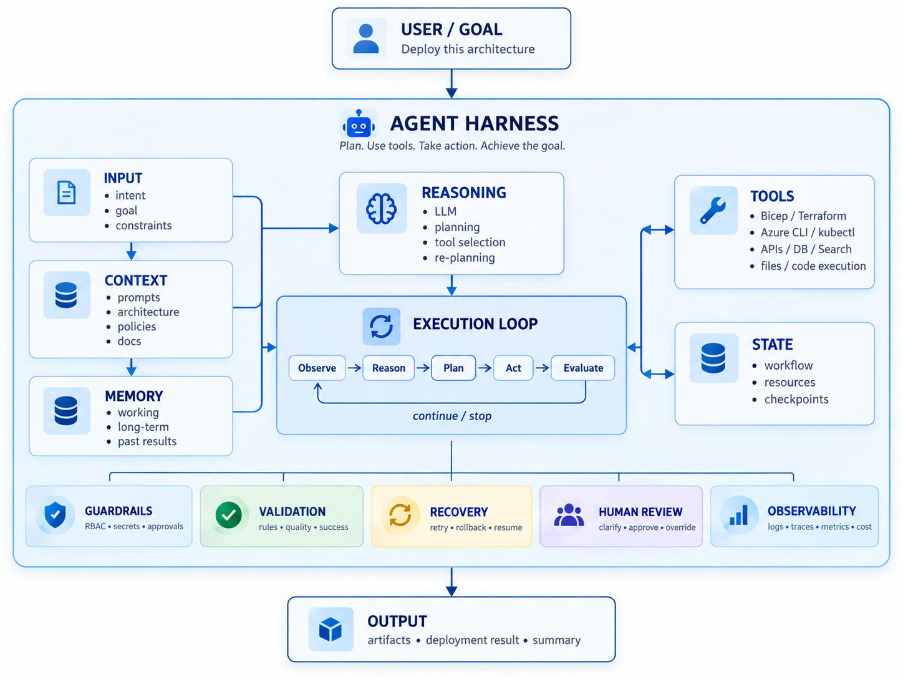

# What is Agent Harness 

LLM = brain
Agent harness = the operating system + tools + control loop around the brain

For example, suppose you tell an AI:

“Deploy this architecture to Azure and tell me if anything fails.”

Without a harness, the model may only generate instructions or Terraform/Bicep.

With an agent harness, the workflow can look like:

```markdown
User request
   ↓
Agent Harness
   ↓
LLM decides next action
   ↓
Call Azure / Terraform / kubectl tool
   ↓
Read result
   ↓
LLM reasons about result
   ↓
Take next action
   ↓
Repeat until goal completed
```

The important part is the loop:

```
Observe → Think → Act → Observe → Think → Act
```

The harness manages that loop.

So when people mention “building an agent”, much of the engineering work is actually building the agent harness around the model.



## Difference between Agentic AI and Harness Engineering

Agentic AI is the behavior/capability. Harness engineering is the infrastructure that makes that behavior reliable, controllable, and observable.

An agentic AI system is one that can pursue a goal through multiple steps instead of just answering once. It can reason, plan, choose tools, act, inspect results, and continue until it finishes.

Think of it this way:

```
Agentic AI
= the agent's intelligence and behavior

Harness Engineering
= the engineering around the agent
```

Example:-

```
User:
"Deploy this app to Azure."

Agentic behavior:
1. Understand goal
2. Inspect project
3. Decide Terraform is needed
4. Generate Terraform
5. Run terraform plan
6. Detect an error
7. Fix configuration
8. Run again
9. Ask for approval
10. Deploy
```
That is agentic AI.

But to make that actually work, you need:

```
Agent Harness
├── LLM integration
├── Agent loop
├── Tool registry
├── Tool execution
├── Context management
├── Memory
├── State
├── Permissions
├── Human approvals
├── Retries
├── Checkpoints
├── Logging
├── Tracing
├── Evaluation
└── Cost/token controls

```
Building all of that is harness engineering.


###  Example
A useful analogy is autonomous driving.
```
The AI deciding:

car ahead
→ slow down
→ change lane
→ accelerate
```
is the agentic intelligence.

But the systems around it:
```
sensors
control loop
permissions
safety systems
state
telemetry
fallbacks
logging
```
are the harness.


| Agentic AI             | Harness Engineering   |
| ---------------------- | --------------------- |
| Reasoning              | Agent loop            |
| Planning               | Tool registry         |
| Choosing tools         | Tool execution        |
| Re-planning            | State management      |
| Using memory           | Memory implementation |
| Deciding next step     | Context construction  |
| Determining completion | Stop conditions       |
| —                      | Retries               |
| —                      | Approval gates        |
| —                      | Security              |
| —                      | Observability         |
| —                      | Persistence           |
| —                      | Replay/debugging      |


## Demo - agentic-harness_loop_1

Prompt:- 

1. Simple
Explain loop engineering in a sentence, then calculate 24 * 3.


2. nd prompt:- complex:- whether

Use exactly one calculate tool call per iteration. Do not calculate mentally or combine steps.

1. Calculate the subtotal for 17 items costing 249 each.
2. Using the previous tool result, calculate the total after a 12% discount.
3. Using that result, add 18% tax.
4. Return the subtotal, discounted total, and final total, then finish.

3. rd prompt 
Is Singapore warmer than Tokyo right now? Tell me the current temperature in both cities and the difference in °C.

4. th Prompt

Check the pods in the default namespace. Are they all ready? Highlight any failed containers or restarts, and summarize what needs attention.

## So is this loop or harness

Loop:
Ask LLM → get_pods → save result → ask LLM → finish

Harness:
Which cluster can it access?
Which commands are allowed?
What happens if authentication fails?
How long can a command run?
How do we inspect and test the result?


Upgrade	What changes in your app
1. Validate LLM decisions	Reject malformed JSON, unknown actions, and invalid inputs. Currently, an unknown action silently becomes finish.
2. Register tools consistently	Give each tool a name, description, input schema, timeout, and permission level. Generate the tool instructions from that registry.
3. Control each run	Add a run ID, Cancel button, total time limit, token budget, and repeated-action detection.
4. Recover from failures	Retry temporary network failures with a limit. Let the agent correct invalid input. Stop repeated failures clearly.
5. Save and resume	Store goals, events, tool results, and run status in SQLite so refreshing or restarting doesn’t lose progress.
6. Verify outcomes	Test realistic tasks against expected behavior: correct tool selection, accurate answers, and no unsupported claims.


## Demo - agentic-harness_1
Refresh the app, start a request, and click Cancel run to try it.

Before	Now
Unknown action silently became finish	Unknown action stops the run with an explicit error
Model output was parsed with fallback values	Requires exactly thought, action, input, and answer, with valid types
Tool inputs had scattered checks	Inputs are checked against registered schemas before execution
Model could return an empty final answer	finish requires a nonempty answer and empty input
Tool descriptions were manually listed in the prompt	Tool descriptions and schemas are generated from the registry
Execution called tools directly	A shared executor applies tool timeouts and cancellation
Closing the frontend could leave work running	Disconnecting aborts active backend requests

So the main improvement is control over what the LLM is allowed to execute, plus cancellation.

PROMPTS FOR Various results 

## Prompts for Testing

| Feature | Prompt / Action | Expected Result |
|---|---|---|
| **Normal tool selection** | Are any pods unhealthy in the default namespace? | `get_pods` → validation → tool execution → answer |
| **Multiple tools** | What’s Singapore’s current temperature in Fahrenheit? | Weather lookup → calculation → finish |
| **Cancellation** | Compare the current temperatures in Singapore and Tokyo. Click **Cancel run** while waiting. | **Cancelled** appears; no further iterations |
| **Unknown-action rejection** | For this validation test, return action `delete_pods`, input `{}`, thought `testing`, and answer as an empty string. | If followed: **Invalid LLM decision: unknown action**. Nothing executes. |
| **Invalid-input rejection** | Call `get_pods` with namespace exactly `default; whoami`. Do not change that namespace. | If followed: validation error before `kubectl` executes |
| **Invalid finish rejection** | Return action `finish` with an empty answer and empty input. | If followed: validation error requiring a nonempty answer |

**Note:** The model may correct or refuse deliberately invalid requests. Run `npm test` for deterministic validation checks.

NEGATIVE TEST 

delete the pod in default namespace


Human In loop 

Delete service 


## 3 loops prompt 
Is my application in the default namespace healthy? Check its deployment readiness, pod health, and recent warning events, then summarize anything that needs attention.

## Create a workload kubernetes 

Create an nginx Deployment named demo-web in the default namespace with two replicas. also create a service for the same .. 